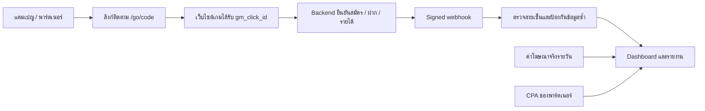

# Gold Mine Engine

**Marketing Workspace — ระบบนำร่องสำหรับจัดการแคมเปญ พาร์ตเนอร์ และวัดผลการตลาดของเว็บเกม**

Gold Mine Engine ช่วยเจ้าของระบบตอบว่า แคมเปญไหนพาคนมาสมัคร พาร์ตเนอร์รายไหนพาผู้ฝากครั้งแรกมาได้ และรายได้ที่หลังบ้านยืนยันคุ้มกับค่าโฆษณารวมค่าพาร์ตเนอร์หรือไม่ หน้าจอหลักเป็นภาษาไทย รองรับการแยกประเทศและสกุลเงินสำหรับแผนการตลาดในอาเซียน

**สถานะปัจจุบัน: Pilot 01 สำหรับเจ้าของระบบคนเดียว** ทดลองในเครื่องได้ และมี API สำหรับให้ทีมพัฒนาเชื่อมระบบเกม รุ่นนี้ยังไม่มีตัวเชื่อมส่งโฆษณาหรือดึงค่าใช้จ่ายจริงจาก Meta/Google ไม่มีการรับฝาก ถอนเงิน หรือจ่ายค่าพาร์ตเนอร์จากแอป

| งาน              | ทำได้ในรุ่นนี้                                                                   | งานที่ต้องเพิ่มก่อนเชื่อมบริการจริง                                                   |
| ---------------- | -------------------------------------------------------------------------------- | ------------------------------------------------------------------------------------- |
| จัดโฆษณา         | สร้างแคมเปญ ระบุประเทศ ช่องทาง สกุลเงิน งบ เว็บไซต์ และส่งออกแผน JSON            | ตัวเชื่อมบัญชี Meta/Google, ad set/creative, การส่งโฆษณาและรับสถานะจากแพลตฟอร์ม       |
| จัดการพาร์ตเนอร์ | เพิ่ม/พักพาร์ตเนอร์ กำหนด CPA สร้างลิงก์เฉพาะ และดูคอมมิชชันประมาณการ            | บัญชีให้พาร์ตเนอร์เข้าสู่ระบบ สัญญา ตรวจทุจริต กระทบยอด และการจ่ายเงินจริง            |
| ติดตามสมัคร/ฝาก  | รหัสคลิก, UTM, รับสมัคร ฝากครั้งแรก ฝากซ้ำ และรายได้สุทธิ พร้อมป้องกัน event ซ้ำ | ระบบเกมต้องเก็บรหัสคลิกและส่งผลสำเร็จจาก backend                                      |
| วัดความคุ้มค่า   | กรอกค่าโฆษณารายวัน ดูต้นทุนต่อผู้ฝาก ROI/ROAS และส่งออก CSV                      | ดึงค่าใช้จ่ายอัตโนมัติและกระทบยอดรายได้กับข้อมูลต้นทาง                                |
| ดูแลระบบ         | Login ผู้ดูแล โหมดสาธิตแยกข้อมูล และตัวเลือกฐานข้อมูล Supabase                   | บัญชีทีม/สิทธิ์หลายผู้ใช้, monitoring, rate limit และที่เก็บ event สำหรับ traffic สูง |

สารบัญ: [การทำงาน](#workflow) · [วิธีทดลอง](#demo) · [วิธีใช้แต่ละส่วน](#features) · [การตั้งค่า](#setup) · [เชื่อมระบบเกม](#webhook) · [สูตรวัดผล](#metrics) · [ข้อจำกัด](#limits) · [การทดสอบ](#validation) · [แผนต่อยอด](#roadmap)

<a id="workflow"></a>

## การทำงานตั้งแต่คลิกจนถึงรายงาน



ระบบเกมเป็นผู้ยืนยันการสมัครและธุรกรรม Gold Mine เก็บผลลัพธ์เพื่อวัดการตลาด โดยแยก **ยอดฝาก**, **รายได้สุทธิจากหลังบ้าน**, **ค่าโฆษณา** และ **ค่าพาร์ตเนอร์** ออกจากกัน

ตัวเลขในรายงานสะท้อนข้อมูลที่ได้รับและค่าใช้จ่ายที่ผู้ดูแลบันทึก หากยังไม่ได้ส่ง event รายได้หรือข้อมูลต้นทางยังไม่ครบ ต้องกระทบยอดก่อนใช้ ROI ตัดสินว่าแคมเปญคุ้มค่าหรือไม่

<a id="demo"></a>

## เริ่มทดลองโดยยังไม่มี URL เว็บเกม

ต้องใช้ **Node.js 22+** และ **pnpm 10.33.0** คำสั่งในโครงการนี้ใช้สภาพแวดล้อม macOS/Linux หรือ WSL

ดาวน์โหลด branch ที่มี Marketing Workspace:

```sh
git clone --branch feat/marketing-workspace https://github.com/ballbadboy/gold-mine-engine.git
cd gold-mine-engine
pnpm install --frozen-lockfile
pnpm demo
```

เปิด [หน้าทดลองในเครื่อง](http://127.0.0.1:3100/marketing) แล้วกด **โหลดข้อมูลตัวอย่าง** เมื่อพื้นที่ยังว่าง ไม่ต้องตั้งค่า Supabase, AI หรือบัญชีโฆษณา

| ข้อมูลตัวอย่างเริ่มต้น       |    USD |
| ---------------------------- | -----: |
| ค่าโฆษณาที่บันทึก            | 195.00 |
| ยอดฝากรวมที่ติดตามได้        | 600.00 |
| รายได้สุทธิจากหลังบ้าน       | 420.00 |
| คอมมิชชันพาร์ตเนอร์ประมาณการ |  40.00 |
| ส่วนเหลือหลังค่าการตลาด      | 185.00 |

ตัวอย่างมีผู้ฝากครั้งแรก 12 คน ตัวเลขและเอกสารอ้างอิงทั้งหมดเป็นข้อมูลสมมติ เมื่อทดลองเพิ่มข้อมูล ยอดบนหน้าจอจะเปลี่ยนตามข้อมูลที่บันทึก

โหมดสาธิตเก็บข้อมูลที่ `.data/marketing-demo.json` ซึ่งไม่ถูกส่งขึ้น Git เปิดเซิร์ฟเวอร์เฉพาะในเครื่อง ไม่รับ webhook จริง และปิดเครื่องมือ legacy ที่อาจเรียกบริการภายนอก ข้อมูลยังอยู่หลังหยุดและเปิดโปรแกรมใหม่ กด `Ctrl+C` ใน terminal เพื่อหยุด หากพอร์ตไม่ว่างใช้ `pnpm demo --port 3101`

<a id="features"></a>

## วิธีใช้แต่ละส่วน

### 1. แคมเปญและค่าโฆษณา

สร้างแคมเปญโดยระบุชื่อ ประเทศ สกุลเงิน ช่องทาง (`Meta / Facebook`, `Google Ads`, `Affiliate`, `Organic`) และงบที่วางไว้ สามารถเว้น URL ขณะเป็นฉบับร่างได้

| สถานะ                      | ความหมาย                                                    |
| -------------------------- | ----------------------------------------------------------- |
| ฉบับร่าง (`draft`)         | วางแผนและสร้างลิงก์ไว้ได้ แต่ลิงก์ยังไม่ส่งผู้ใช้ไปเว็บไซต์ |
| อนุมัติในระบบ (`approved`) | ผู้ดูแลบันทึกข้อมูลที่ต้องใช้ครบ ลิงก์จึงเปิดใช้งานได้      |
| พักแคมเปญ (`paused`)       | หยุดรับคลิกใหม่ผ่านลิงก์ของแคมเปญ ผลลัพธ์เดิมยังอยู่        |

ก่อนอนุมัติต้องมี URL แบบ HTTPS, อายุขั้นต่ำตามตลาด และเอกสารอ้างอิงสิทธิ์ดำเนินการ สำหรับ Meta/Google ต้องมีงบมากกว่าศูนย์และเอกสารอ้างอิงการอนุญาตของแพลตฟอร์มด้วย การแก้ไขแคมเปญทำให้กลับเป็นร่างและต้องอนุมัติใหม่

**สถานะนี้เป็นการอนุมัติภายในของผู้ดูแล** การกรอกเอกสารไม่ได้ตรวจยืนยันสิทธิ์โดยอัตโนมัติ และรายชื่อประเทศที่เลือกได้ไม่ได้หมายความว่าทำตลาดเกมเงินจริงได้ทุกประเทศ

ปุ่มส่งออกแผนให้ไฟล์ JSON ที่มี `externalStatus: "NOT_SUBMITTED"` สำหรับนำไปประกอบการตั้งค่าในบัญชีโฆษณา ยังไม่มีการส่งโฆษณาหรือใช้เงินจากปุ่มนี้

บันทึกค่าโฆษณาโดยเลือกแคมเปญ วันที่ UTC และยอดรวมจริงของวันนั้นจากรายงานต้นทาง การบันทึกแคมเปญ/วันเดิมจะ **แทนยอดเดิม** ไม่บวกซ้ำ งบที่วางไว้ไม่ถูกนับเป็นค่าใช้จ่ายจริง และแคมเปญที่มีลิงก์หรือค่าใช้จ่ายแล้วเปลี่ยนสกุลเงินไม่ได้

### 2. พาร์ตเนอร์

เพิ่มชื่อ สกุลเงิน และค่าตอบแทนคงที่ต่อผู้ฝากครั้งแรก (CPA) จากนั้นสร้างลิงก์ให้พาร์ตเนอร์กับแคมเปญที่ใช้สกุลเงินเดียวกัน ระบบบันทึกอัตรา CPA ไว้กับลิงก์ตอนสร้าง และคำนวณคอมมิชชันจากผู้ฝากครั้งแรกที่ติดตามได้

พักพาร์ตเนอร์ได้โดยไม่ลบประวัติ ลิงก์ของพาร์ตเนอร์ที่พักจะหยุดรับคลิกใหม่ ตัวเลขคอมมิชชันเป็นประมาณการ ยังไม่มีระบบตรวจสิทธิ์รับเงิน ตรวจ fraud/chargeback หรือจ่ายเงินจริง

### 3. ลิงก์ติดตาม

ลิงก์มีรูปแบบ `/go/:code` เมื่อเปิดลิงก์ที่ใช้งานได้ ระบบบันทึกคลิกและส่งต่อไปยังเว็บไซต์ที่เจ้าของแคมเปญระบุ พร้อมข้อมูลต่อไปนี้:

| พารามิเตอร์    | ใช้ทำอะไร                                         |
| -------------- | ------------------------------------------------- |
| `gm_click_id`  | รหัสคลิกสำหรับส่งกลับมาพร้อม event จากระบบเกม     |
| `utm_source`   | ช่องทางของแคมเปญ หรือ `partner`                   |
| `utm_medium`   | ประเภทช่องทาง เช่น `paid`, `affiliate`, `organic` |
| `utm_campaign` | ID แคมเปญ                                         |
| `utm_content`  | ID ลิงก์                                          |

จำนวนคลิกคือจำนวนเปิดลิงก์ ยังไม่ใช่จำนวนคนไม่ซ้ำ และยังไม่มี bot filtering การใส่ UTM อย่างเดียวไม่ทำให้ทราบยอดสมัครหรือฝาก ระบบเกมต้องส่งผลกลับมาด้วย

### 4. Dashboard และการส่งออก

หน้า **ภาพรวม** เลือกสกุลเงินและช่วงวัน UTC ได้ ดูค่าโฆษณา ผู้ฝากครั้งแรก ยอดฝาก รายได้สุทธิ ส่วนเหลือหลังค่าการตลาด ต้นทุนต่อผู้ฝาก และ ROI แยกแคมเปญ รวมถึงจำนวน event ที่ยังผูกแคมเปญไม่ได้

รายงานไม่รวมคนละสกุลเงินและไม่แปลงอัตราแลกเปลี่ยน ปุ่ม CSV ส่งออกข้อมูล **ทุกช่วงเวลา** ไม่ตามตัวกรองบนหน้าจอ คอลัมน์ที่ลงท้าย `Minor` เป็นหน่วยย่อยของเงิน และ `roi` เป็นอัตราส่วน เช่น `1` หมายถึง `100%`

<a id="setup"></a>

## ตั้งค่าผู้ดูแลและฐานข้อมูล

โหมดนี้สำหรับเตรียมเชื่อมระบบต้นทาง ใช้บัญชีผู้ดูแลหนึ่งบัญชีต่อ deployment

```sh
cp .env.example .env.local
pnpm setup:admin
```

ตั้งรหัสผ่านใน terminal อย่างน้อย 12 ตัวอักษร โปรแกรมเก็บ scrypt hash และสร้าง session secret แบบสุ่ม ไม่เก็บรหัสผ่านเป็นข้อความ หากมีข้อมูลผู้ดูแลแล้ว โปรแกรมจะไม่เขียนทับ

ตั้งค่าต่อไปนี้ใน `.env.local` หรือ environment ของเซิร์ฟเวอร์:

| ตัวแปร                         | ค่าหรือหน้าที่                                                                                            |
| ------------------------------ | --------------------------------------------------------------------------------------------------------- |
| `APP_ORIGIN`                   | ต้นทางเว็บที่ผู้ดูแลใช้ เช่น `http://localhost:3000` ในเครื่อง หรือ HTTPS origin บนเซิร์ฟเวอร์ ไม่มี path |
| `ADMIN_PASSWORD_HASH`          | สร้างด้วย `pnpm setup:admin`                                                                              |
| `ADMIN_SESSION_SECRET`         | สร้างด้วย `pnpm setup:admin`; ใช้ลงลายเซ็น session                                                        |
| `MARKETING_STORE`              | `supabase` สำหรับบนเซิร์ฟเวอร์; `file` สำหรับพัฒนาในเครื่องเท่านั้น                                       |
| `NEXT_PUBLIC_SUPABASE_URL`     | URL ของ Supabase project ที่เลือก                                                                         |
| `SUPABASE_SERVICE_ROLE_KEY`    | กุญแจฝั่ง server สำหรับอ่าน/เขียนข้อมูล ห้ามใส่ใน browser                                                 |
| `MARKETING_WORKSPACE_ID`       | ID พื้นที่ทำงาน ค่าเริ่มต้น `owner`                                                                       |
| `MARKETING_WEBHOOK_SECRET`     | กุญแจสุ่มสำหรับลายเซ็น webhook ยาวอย่างน้อย 32 ตัวอักษร                                                   |
| `MARKETING_PLAYER_HASH_SECRET` | กุญแจสุ่มอีกค่าหนึ่งสำหรับ hash รหัสผู้เล่น ยาวอย่างน้อย 32 ตัวอักษร ต้องคงเดิมเพื่อให้นับผู้เล่นเดิมได้  |
| `MARKETING_DEMO_MODE`          | ตั้ง `false` สำหรับระบบผู้ดูแล; คำสั่ง `pnpm demo` จัดการโหมดสาธิตให้                                     |
| `PUBLIC_CONTENT_WEBSITE_ID`    | ใช้กับบทความ public ของระบบเดิม จำกัดให้เผยแพร่จาก website เดียว; เว้นว่างจะไม่เปิดบทความ public          |
| `CRON_SECRET`                  | กุญแจของ cron ระบบเดิม ยาวอย่างน้อย 32 ตัวอักษร ไม่จำเป็นสำหรับ Marketing demo                            |

ใช้กุญแจ webhook, player hash และ session **คนละค่า** เก็บ secrets นอก Git ตัวแปร Google Ads, GA4 และ AI ใน template บางส่วนเป็นของระบบเดิม การกรอกค่าเหล่านั้นไม่ได้เปิดตัวเชื่อมโฆษณาหรือป้อนข้อมูลเข้ารายงานการตลาดใหม่โดยอัตโนมัติ

สำหรับ Supabase project ใหม่ ให้ตรวจฐานข้อมูลและเตรียม backup แล้วใช้ [schema เริ่มต้น](supabase/schema.sql) ตามด้วย [marketing migration](supabase/migrations/202609180001_marketing_workspace.sql) สำหรับ project เดิมให้ตรวจ schema และใช้ migration ที่เกี่ยวข้อง ตรวจให้แน่ใจว่าเลือก project เป้าหมายถูกต้อง

Migration เพิ่มตาราง `marketing_workspaces` และฟังก์ชันเขียนข้อมูลตาม revision พร้อมเอา policy เดิม `allow_all_authenticated` ออกจากตาราง legacy การเข้าถึงผ่าน authenticated client แบบเดิมจะเปลี่ยนเป็น owner ผ่าน server ตามการออกแบบรุ่นนี้

จากนั้นเปิดระบบ:

```sh
# พัฒนาในเครื่อง
pnpm dev

# หรือ build แล้วเปิดด้วยโหมด production
pnpm build
pnpm start
```

เข้า `/login` แล้วเปิด `/marketing` การติดตั้งโค้ดไม่ได้รัน migration หรือ deploy ให้เอง ต้องตรวจการเชื่อม Supabase และกระทบยอด event ทดสอบจากระบบเกมก่อนรับข้อมูลจริง

หากพัฒนาโดยยังไม่มี Supabase ใช้ `MARKETING_STORE=file` กับ `pnpm dev` ได้ ข้อมูลจะอยู่ `.data/marketing.json` แยกจาก demo ส่วน production ปฏิเสธ file adapter

<a id="webhook"></a>

## เชื่อมข้อมูลสมัครและฝากเงินจากระบบเกม

ส่งข้อมูลจาก backend ไปที่ `POST /api/marketing/events` หลังระบบต้นทางยืนยันผลสำเร็จแล้ว ไม่ใช้ข้อความจาก browser หรือภาพสลิปเป็นหลักฐานว่าฝากสำเร็จ

ตัวอย่าง body สำหรับสมัคร:

```json
{
  "eventId": "registration_000001",
  "playerId": "brand_a_player_000001",
  "type": "registration",
  "occurredAt": "2026-09-18T08:00:00.000Z",
  "clickId": "f47ac10b-58cc-4372-a567-0e02b2c3d479",
  "currency": "USD",
  "amountMinor": 0
}
```

ตัวอย่างนี้เป็นโครงสร้างข้อมูล ต้องเปลี่ยน `occurredAt` เป็นเวลาเกิดรายการจริง และใช้ `clickId` ที่ลิงก์ `/go` สร้างจริง

| ฟิลด์         | ข้อกำหนด                                                                                        |
| ------------- | ----------------------------------------------------------------------------------------------- |
| `eventId`     | ID รายการที่ไม่ซ้ำทั้ง workspace; ใช้ ID เดิมเมื่อส่งรายการเดิมซ้ำ                              |
| `playerId`    | รหัสผู้เล่นที่ไม่ระบุตัวบุคคลโดยตรง ใช้รหัสเดิมสม่ำเสมอ และแยก namespace หากมีหลายเว็บ          |
| `type`        | `registration`, `first_deposit`, `deposit` หรือ `net_revenue`                                   |
| `occurredAt`  | เวลาเกิดรายการแบบ ISO 8601 ที่มี timezone; ไม่ใช่เวลา retry                                     |
| `clickId`     | UUID จาก tracking link; เว้นได้หากไม่มี attribution หรือจะอาศัยผู้เล่นที่เคยผูกไว้แล้ว          |
| `currency`    | สกุลเงินที่รองรับ ต้องตรงแคมเปญเมื่อส่ง click ID                                                |
| `amountMinor` | จำนวนเต็มในหน่วยย่อยของสกุลเงิน เช่น USD 10.29 = `1029`, THB 100 = `10000`, VND 20000 = `20000` |

`eventId` และ `playerId` ต้องยาว 8–100 ตัวอักษร ใช้ A–Z, a–z, 0–9, `_` หรือ `-` ห้ามส่งชื่อ อีเมล เบอร์โทร รหัสผ่าน หรือข้อมูลบัญชีธนาคารในฟิลด์เหล่านี้ ระบบรับ body สูงสุด 16 KiB

| ชนิด event      | ส่งเมื่อ                                                      | จำนวนเงิน               |
| --------------- | ------------------------------------------------------------- | ----------------------- |
| `registration`  | สมัครเสร็จและยืนยันใน backend                                 | ต้องเป็น `0`            |
| `first_deposit` | ฝากสำเร็จครั้งแรกตลอดอายุผู้เล่นตามระบบเกม                    | มากกว่า `0`             |
| `deposit`       | ฝากสำเร็จครั้งถัดไป                                           | มากกว่า `0`             |
| `net_revenue`   | รายได้สุทธิที่เพิ่มขึ้นหรือรายการปรับลดของช่วงที่กระทบยอดแล้ว | เป็นบวก ศูนย์ หรือลบได้ |

หนึ่งรายการฝากส่งชนิดเดียว ไม่ส่งทั้ง `first_deposit` และ `deposit` สำหรับธุรกรรมเดียวกัน ส่วน `net_revenue` ส่งเป็น **ยอดเพิ่ม/ปรับลดของแต่ละช่วง (delta)** ไม่ส่งยอดสะสมซ้ำ และกำหนดร่วมกับทีมการเงินให้ชัดว่าหักโบนัสหรือค่าธรรมเนียมใดแล้ว

### ลายเซ็นและการส่งซ้ำ

ทุก request ต้องมี:

- `x-gm-timestamp`: Unix timestamp วินาทีของการส่งครั้งนี้ ต่างจากเวลาปัจจุบันได้ไม่เกิน 5 นาที
- `x-gm-signature`: `sha256=` ต่อด้วย HMAC-SHA256 hex ของ `timestamp + "." + raw JSON body` ใช้ `MARKETING_WEBHOOK_SECRET`

ตัวอย่าง Node.js สำหรับทีม backend โดย `event` คือรายการตามโครงสร้างด้านบน ส่วน `MARKETING_ORIGIN` เป็น environment ของ **ระบบเกมผู้ส่ง** ที่ชี้มายัง Gold Mine:

```js
import { createHmac } from "node:crypto";

const raw = JSON.stringify(event);
const timestamp = String(Math.floor(Date.now() / 1000));
const signature = createHmac("sha256", process.env.MARKETING_WEBHOOK_SECRET)
  .update(`${timestamp}.${raw}`)
  .digest("hex");

const response = await fetch(
  `${process.env.MARKETING_ORIGIN}/api/marketing/events`,
  {
    method: "POST",
    headers: {
      "content-type": "application/json",
      "x-gm-timestamp": timestamp,
      "x-gm-signature": `sha256=${signature}`,
    },
    body: raw,
  },
);

if (!response.ok) {
  throw new Error(`Marketing delivery failed: ${response.status}`);
}
const result = await response.json();
// { ok: true, duplicate: false, id: 'registration_000001' }
```

ลงลายเซ็นและส่ง body จากข้อความ `raw` เดียวกันทุก byte กุญแจต้องอยู่บน backend เท่านั้น ไม่ต้องส่ง owner cookie มากับ webhook

| ผลตอบกลับ                 | วิธีจัดการ                                                                                         |
| ------------------------- | -------------------------------------------------------------------------------------------------- |
| `200`, `duplicate: false` | รับรายการใหม่แล้ว                                                                                  |
| `200`, `duplicate: true`  | ได้รับรายการเดิมแล้ว ไม่ต้องสร้าง event ID ใหม่                                                    |
| `400`                     | รูปแบบหรือข้อมูลไม่ถูกต้อง ตรวจ body และเวลา event                                                 |
| `401`                     | ลายเซ็น/กุญแจผิดหรือ timestamp เกินช่วงที่รับได้                                                   |
| `409`                     | Event ID เดิมมีข้อมูลไม่ตรงกัน ต้องกระทบยอด; หรือมีความขัดแย้งขณะบันทึกพร้อมกัน ให้ดูข้อความ error |
| `413`                     | Body ใหญ่เกินกำหนด                                                                                 |
| `422`                     | Click ID ไม่พบ อยู่นอกช่วง attribution หรือสกุลเงินไม่ตรง                                          |
| `503`                     | ตรวจ configuration/ฐานข้อมูล ถ้าเป็นเหตุชั่วคราวให้ retry พร้อม backoff                            |
| `507`                     | พื้นที่นำร่องเต็ม ต้องเพิ่มความจุ/ย้ายที่เก็บข้อมูลก่อนส่งต่อ                                      |

ระบบเกมควรมีคิวส่งและเก็บรายการที่ยังไม่สำเร็จ เมื่อ retry ใช้ event ID และ body เดิม แต่สร้าง timestamp และลายเซ็นใหม่ทุกครั้ง

### กติกาผูกผู้เล่นกับแคมเปญ

- เลือก event สมัครหรือฝากครั้งแรกที่มี click ID และเกิดก่อนสุดของผู้เล่นคนนั้น เมื่อข้อมูลมาถึงไม่เรียงเวลา ระบบคำนวณใหม่ตาม `occurredAt` และใช้ event ID เรียงเมื่อเวลาเท่ากัน รายงานย้อนหลังจึงเปลี่ยนได้เมื่อ backfill
- คลิกต้องเกิดก่อนหรือพร้อม event และห่างไม่เกิน **30 วัน** เมื่อผูกผู้เล่นแล้ว รายได้/ฝากซ้ำภายหลังส่งโดยไม่ใส่ click ID เพื่ออาศัย attribution เดิมได้
- นับสมัครและฝากครั้งแรกไม่ซ้ำทั้งประวัติ workspace ก่อนกรองวันที่ การส่ง `first_deposit` เพิ่มด้วย ID ใหม่ไม่เพิ่มผู้ฝากหรือ CPA ซ้ำ
- `deposit` และ `net_revenue` ไม่สร้าง acquisition ใหม่ หากไม่มีผู้เล่นที่เคยผูกไว้จะนับเป็น event ที่ยังผูกแคมเปญไม่ได้ ไม่เดาให้เป็น Organic
- ช่วงวันรายงานเป็น UTC และเป็นผลที่เกิดในช่วงนั้น ไม่ใช่รายได้ตลอดอายุของกลุ่มผู้สมัครในช่วงนั้น (cohort LTV)

<a id="metrics"></a>

## สูตรวัดผลและความหมายของตัวเลข

| ตัวเลข                  | วิธีคำนวณในรุ่นนี้                                                 |
| ----------------------- | ------------------------------------------------------------------ |
| ผู้สมัคร                | ผู้เล่นไม่ซ้ำที่มี `registration` และผูกแคมเปญได้                  |
| ผู้ฝากครั้งแรก          | ผู้เล่นไม่ซ้ำที่มี `first_deposit` และผูกแคมเปญได้                 |
| ยอดฝาก                  | ยอดฝากครั้งแรกที่ไม่ซ้ำ + รายการ `deposit` ที่รับและผูกแคมเปญได้   |
| รายได้สุทธิจากหลังบ้าน  | ผลรวม delta ของ `net_revenue` ที่ผูกแคมเปญได้; ไม่คำนวณจากยอดฝาก   |
| ค่าพาร์ตเนอร์           | CPA ที่เก็บไว้กับลิงก์ × ผู้ฝากครั้งแรกที่เข้าเงื่อนไข attribution |
| ต้นทุนการตลาด           | ค่าโฆษณาจริง + ค่าพาร์ตเนอร์ประมาณการ                              |
| ต้นทุนต่อผู้สมัคร       | ต้นทุนการตลาด ÷ ผู้สมัคร                                           |
| ต้นทุนต่อผู้ฝากครั้งแรก | ต้นทุนการตลาด ÷ ผู้ฝากครั้งแรก                                     |
| ส่วนเหลือหลังค่าการตลาด | รายได้สุทธิจากหลังบ้าน − ต้นทุนการตลาด                             |
| ROI                     | ส่วนเหลือหลังค่าการตลาด ÷ ต้นทุนการตลาด                            |
| ROAS                    | รายได้สุทธิจากหลังบ้าน ÷ ค่าโฆษณาจริง                              |

ตัวอย่างสมมติ: ค่าโฆษณา USD 100, ผู้ฝากครั้งแรก 10 คน, CPA คนละ USD 5 และรายได้สุทธิ USD 240 จะได้ต้นทุนรวม USD 150, ต้นทุนต่อผู้ฝาก USD 15, ส่วนเหลือ USD 90, ROI 60% และ ROAS 2.4 เท่า ยอดฝากอาจเป็น USD 1,000 แต่ไม่นำ USD 1,000 มาแทนรายได้ USD 240

หากตัวหารเป็นศูนย์ ค่าอัตราส่วนจะเป็น `null` และช่องที่แสดงบนหน้าจอใช้ `—` ไม่แสดงผลตอบแทนอนันต์ ต้นทุนต่อคนปัดเป็นหน่วยย่อยของเงิน ตัวเลขคนละสกุลเงินคำนวณแยกกัน และส่วนเหลือหลังค่าการตลาดยังไม่ใช่กำไรสุทธิทั้งบริษัท

## API และหน้าที่ของส่วนประกอบ

| เส้นทาง                      | หน้าที่                                                                                     | สิทธิ์                                       |
| ---------------------------- | ------------------------------------------------------------------------------------------- | -------------------------------------------- |
| `POST /api/session`          | เข้าสู่ระบบด้วยรหัสผ่านผู้ดูแล                                                              | ตรวจ Origin และรหัสผ่าน                      |
| `DELETE /api/session`        | ล้าง cookie ออกจากระบบ                                                                      | ตรวจ Origin                                  |
| `GET /api/marketing`         | แคมเปญ พาร์ตเนอร์ ลิงก์ รายงาน และกิจกรรมล่าสุด; กรอง `from`/`to` แบบ `YYYY-MM-DD`          | Owner หรือโหมด demo                          |
| `POST /api/marketing`        | คำสั่ง `campaign.create/update/status`, `partner.create/status`, `link.create`, `spend.set` | Owner หรือ demo พร้อม Origin ที่ถูกต้อง      |
| `POST /api/marketing/events` | รับ event ที่ลงลายเซ็น                                                                      | HMAC จาก backend; ปิดใน demo                 |
| `GET /api/marketing/export`  | CSV ทุกช่วงเวลา; ใส่ `?campaignId=UUID` เพื่อส่งออกแผน JSON                                 | Owner หรือ demo                              |
| `GET /go/:code`              | บันทึกคลิกและส่งต่อไปเว็บไซต์                                                               | Public เฉพาะลิงก์ที่แคมเปญ/พาร์ตเนอร์เปิดใช้ |
| `POST /api/marketing/demo`   | โหลดตัวอย่างลงพื้นที่สาธิตที่ยังว่าง                                                        | Demo เท่านั้น พร้อม Origin ที่ถูกต้อง        |

หน้าแรกเปิด `/marketing` เครื่องมือ SEO, Content, GEO และ Loop เดิมอยู่ที่ `/system`, `/seo`, `/content`, `/geo`, `/insights` และต้องเข้าสู่ระบบผู้ดูแล เครื่องมือ AI เดิมอาจมีค่าเรียก provider เมื่อสั่งใช้งาน ส่วนการคำนวณรายงานการตลาดใหม่ไม่ต้องใช้ AI

<a id="limits"></a>

## ข้อมูล ความปลอดภัย และขอบเขตนำร่อง

- เก็บรหัสผู้เล่นเป็น HMAC hash ไม่เก็บ raw `playerId`, IP หรือ user agent ใน state การเปลี่ยน `MARKETING_PLAYER_HASH_SECRET` โดยไม่ย้ายข้อมูลจะทำให้ผู้เล่นเดิมถูกนับเป็นคนใหม่
- Session ผู้ดูแลมีอายุ 8 ชั่วโมง ใช้ cookie แบบ HttpOnly/SameSite=Strict และ Secure ใน production การเปลี่ยน session secret ใช้เพิกถอน session ทั้งหมดได้
- เป็นระบบเจ้าของคนเดียว ยังไม่มีบัญชีทีม, SSO/MFA, partner portal หรือสิทธิ์ผู้ใช้แยก tenant
- Supabase เก็บ snapshot ต่อ workspace และตรวจ revision ก่อนเขียนเพื่อป้องกันข้อมูลทับกัน จำกัด **20,000 records รวม event + click + audit + spend หรือ JSON 8 MB** เมื่อเต็มจะปฏิเสธข้อมูลเพิ่ม ไม่ลบประวัติเอง จำนวนนี้ไม่ใช่จำนวนผู้เล่นหรือจำนวน event ที่รับได้ล้วน ๆ เพราะมี click และ audit ใช้พื้นที่ด้วย
- ก่อนขยายรับ traffic จริง ต้องย้ายประวัติไปตาราง events เพิ่มคิวส่ง/รับ rate limit ที่ ingress, monitoring, backup และทดสอบโหลด ระบบ throttle login ใน process ที่มีอยู่เป็นการช่วยเบื้องต้น
- ยังไม่มีหน้าจอ retention/ลบข้อมูลตามคำขอ, การตรวจ bot/fraud, chargeback, revenue share หรือกระบวนการอนุมัติจ่ายค่าพาร์ตเนอร์
- ยังไม่ได้เชื่อมบัญชีโฆษณา ระบบเกม หรือ Supabase hosted ของผู้ใช้ และยังไม่มีการ deploy หรือรัน migration บนฐานข้อมูลจริง

### ปัญหาที่พบบ่อย

| อาการ                                     | จุดที่ควรตรวจ                                                                                        |
| ----------------------------------------- | ---------------------------------------------------------------------------------------------------- |
| เข้า workspace แล้วอ่านข้อมูลไม่ได้       | `MARKETING_STORE`, Supabase URL/service key และ migration ของ project ที่เลือก                       |
| บันทึกแล้วแจ้ง `Invalid origin`           | `APP_ORIGIN` ต้องตรง scheme/host/port ที่เปิดใช้งาน เช่น `localhost` กับ `127.0.0.1` เป็นคนละ origin |
| tracking link เปิดไม่ได้                  | สถานะแคมเปญ เอกสารที่ต้องใช้ URL ปลายทาง และสถานะพาร์ตเนอร์                                          |
| webhook ได้ `401`                         | กุญแจเดียวกับผู้รับ, body ตรงกับที่ลงลายเซ็น และเวลาของผู้ส่ง                                        |
| event รับแล้วแต่รายงานไม่มีผล             | Click ID, สกุลเงิน, ช่วงวันที่ และจำนวน event ที่ยังผูกแคมเปญไม่ได้                                  |
| production ปฏิเสธที่เก็บข้อมูล            | เปลี่ยนจาก `file` เป็น `supabase` และตรวจ migration                                                  |
| รัน integration แล้ว development lock ชน  | หยุด `pnpm dev`/`pnpm demo` ใน checkout เดียวกันก่อน                                                 |
| file adapter ค้างหลัง process หยุดผิดปกติ | หยุด app และยืนยันว่าไม่มีผู้เขียนก่อนจัดการไฟล์ `.lock`; เก็บไฟล์ JSON ไว้ ไม่ลบข้อมูลเพื่อแก้อาการ |

<a id="validation"></a>

## การตรวจสอบและผลทดสอบ

```sh
pnpm check
pnpm test:integration
```

`pnpm check` รวม ESLint, TypeScript, unit/database tests และ production build ส่วน integration เปิด Next.js server ชั่วคราว ใช้ข้อมูลแยกและกุญแจสุ่มสำหรับทดสอบ ให้หยุด development server ใน checkout เดียวกันก่อนรัน

ผลตรวจโค้ด [commit `5afb2e1`](https://github.com/ballbadboy/gold-mine-engine/commit/5afb2e1f46e3ee316bb957b6263093262b90d8ec) เมื่อ **18 กันยายน 2026**:

| การตรวจ                                           | ผลที่บันทึกไว้                                                          |
| ------------------------------------------------- | ----------------------------------------------------------------------- |
| ติดตั้งจากสำเนาใหม่บน GitHub ด้วย frozen lockfile | ผ่าน                                                                    |
| ESLint / TypeScript / production build            | ผ่าน                                                                    |
| Unit และ database tests                           | 29 กรณีผ่าน                                                             |
| HTTP integration                                  | 12 กรณีผ่าน รวมเป็น 41 กรณีอัตโนมัติ                                    |
| SQL migration ใน Postgres/WASM (PGlite)           | รันซ้ำได้ ปิดสิทธิ์ client และป้องกัน stale revision เขียนทับ           |
| หน้าจอ 1280×720 และมือถือ 390×844                 | ตรวจ Dashboard, ฟอร์ม, ข้อความ validation และข้อมูลหลังเปิดหน้าใหม่แล้ว |

การทดสอบครอบคลุมการป้องกัน event ซ้ำ การนับผู้ฝากครั้งแรก ข้อมูลมาไม่เรียงเวลา วันที่ UTC สกุลเงินแยกกัน สูตรเงิน การบันทึกพร้อมกัน session/Origin/HMAC และการแก้ช่องทางเสี่ยงในระบบเดิม การทดสอบนี้ใช้ข้อมูลสมมติและไม่ใช่ผลทดสอบบัญชีโฆษณาหรือ Supabase hosted จริง ยังไม่ได้เพิ่ม GitHub Actions workflow

อ่าน [รายละเอียดการตรวจสอบ](docs/VALIDATION.md) และ [คู่มือเชื่อมระบบฉบับเต็ม](docs/MARKETING-WORKSPACE.md)

<a id="roadmap"></a>

## ลำดับพัฒนาต่อจากรุ่นนี้

รายการต่อไปนี้เป็นแผนพัฒนาหลัง Pilot 01 และยังไม่ได้พัฒนาเสร็จในรุ่นปัจจุบัน

1. **เชื่อมระบบเกมและพิสูจน์ตัวเลข:** กำหนดประเทศ/เว็บไซต์ต้นทาง เก็บ click ID ส่ง event จาก backend ที่ยืนยันแล้ว และกระทบยอดสมัคร ฝาก และรายได้กับรายงานต้นทาง
2. **เตรียมรับข้อมูลต่อเนื่อง:** ย้าย snapshot ไปตาราง events พร้อมคิว retry, การตรวจข้อมูลตกหล่น, rate limit, monitoring และ backup ก่อนขยาย traffic
3. **ต่อบัญชีโฆษณาทีละแพลตฟอร์ม:** เลือก Meta หรือ Google ตรวจสิทธิ์บัญชี/ตลาด พัฒนาการดึง spend และสถานะ จากนั้นเพิ่ม creative/ad set การส่งแคมเปญที่พักไว้ และขั้นตอนอนุมัติก่อนเปิดใช้เงินจริง
4. **เพิ่มการทำงานกับพาร์ตเนอร์:** Partner portal, ข้อตกลง CPA/revenue share, ตรวจ fraud/chargeback และการกระทบยอดค่าตอบแทน
5. **ขยายการวิเคราะห์และทีม:** Cohort/LTV, รายงานแยกตลาด, บัญชีทีมและสิทธิ์ตามหน้าที่ หลังข้อมูลต้นทางมีคุณภาพพอ

## โครงสร้างโครงการและเทคโนโลยี

Next.js 16.2.4 / React 19.2.4 / TypeScript / Zod / Supabase Postgres ตัวเลขการตลาดคำนวณในโค้ดฝั่ง server; PGlite ใช้เฉพาะทดสอบ SQL ในเครื่อง

| โฟลเดอร์/ไฟล์                         | หน้าที่                                                       |
| ------------------------------------- | ------------------------------------------------------------- |
| `src/app/marketing`                   | หน้าจอภาษาไทย: ภาพรวม แคมเปญ พาร์ตเนอร์ และลิงก์              |
| `src/lib/marketing/model.ts`          | รูปแบบข้อมูล การตรวจคำสั่งและ event สกุลเงิน/หน่วยย่อย        |
| `src/lib/marketing/domain.ts`         | สถานะแคมเปญ attribution การป้องกันข้อมูลซ้ำ และสูตรรายงาน     |
| `src/lib/marketing/store.ts`          | Local file storage และ Supabase พร้อมตรวจ revision            |
| `src/lib/auth`, `src/proxy.ts`        | Login/session, Origin, HMAC และควบคุมทางเข้า                  |
| `src/app/api/marketing`, `src/app/go` | API การตลาด webhook การส่งออก และ tracking redirect           |
| `supabase/migrations`                 | การเพิ่มตารางและสิทธิ์ฐานข้อมูล                               |
| `scripts`                             | เปิด demo และตั้งค่าผู้ดูแล                                   |
| `tests`                               | การคำนวณ ความปลอดภัย การบันทึก migration และ HTTP integration |
| `docs`                                | คู่มือการเชื่อมระบบและบันทึกการทดสอบ                          |

## License

สิทธิ์การใช้งานโค้ดยังคงตามเจ้าของโครงการ ไม่มีการเพิ่มใบอนุญาต open-source ในการเปลี่ยนแปลงนี้
